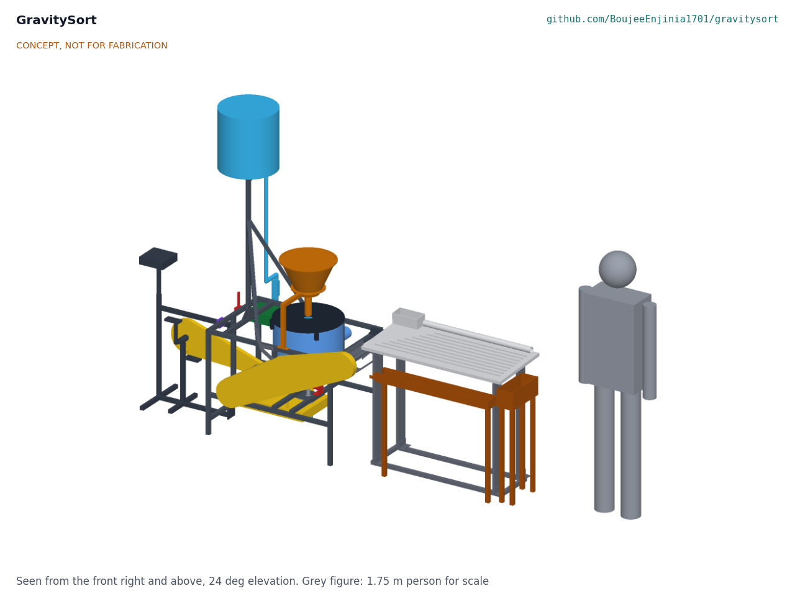
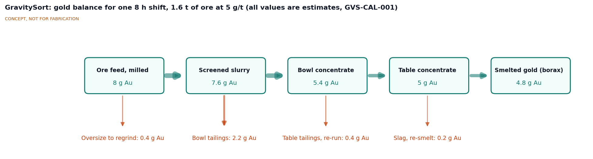
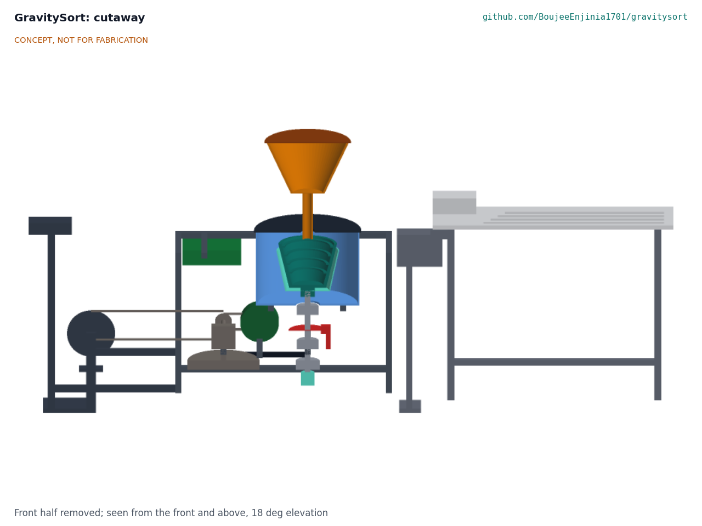
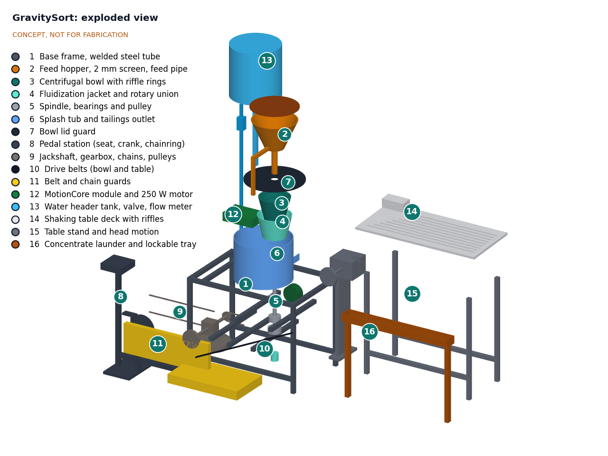

# GravitySort design precis

## Summary

GravitySort is a two-stage, mercury-free gravity concentrator for small mining groups. A fluidized centrifugal bowl (220 mm across the lip, about 60 G at 730 rpm) catches fine gold from about 200 kg/h of milled ore, and a small shaking table (1,000 x 450 mm) cleans the day's bowl concentrate (about 5.3 kg) down to about 100 g, small enough to smelt directly with borax. One drive, either a pedal crank or a 250 W motor through the lab's MotionCore module, runs the bowl by day and the table at clean-up. A bicycle disc brake stops the bowl, and the lid can be opened only with the brake set. The whole machine is a welded frame of 25 x 25 x 1.5 mm steel tube about 2.8 m long, about 97 kg in six loads of 25 kg or less, built from bicycle parts, bearings, V-belts, HDPE drums and a cast polyurethane bowl liner. The sizing note GVS-CAL-001 gives 48 W at the pedals at 60 G and 1.19 m3/h of water; about 60 % overall gold recovery on free-gold ore is assumed, compared with about 30 % typical of whole-ore amalgamation in Colombian processing centers ([Veiga et al., 2018](https://doi.org/10.1016/j.jclepro.2018.09.039)). Value-engineering target: USD 455. Estimated cost of the constructable design: USD 569 (USD 114 over the target). Making every part buildable (GVS-DDR-003, accepted by Amish on 2026-10-01) took the mass over R11's original 80 kg total; Amish restated R11 to 100 kg or less in all, with every load 30 kg or less, so it is met on paper. R2, R5 and R6 are at risk. The prototype build plan is GVS-BLD-001 (`docs/05-build-plan.md`); open decisions are in GVS-DEC-001 (`docs/06-design-decisions.md`). All figures are estimates for review, not measurements.

*Figure 1. GravitySort with a 1.75 m person for scale. Pedal station on the left, centrifuge frame with hopper and water tank in the middle, shaking table on the right. Generated from the TRL 3 model `cad/src/model.py`; general arrangement in drawing GVS-DWG-001.*

## Design approach

### How it works

1. **Feed.** Ore milled to below about 2 mm is shovelled or washed onto the 2 mm punched screen on top of the hopper. Oversize goes back to the mill. Water from the header tank carries the undersize down a feed pipe into the centre of the bowl as a slurry of about 30 % solids.
2. **Concentrate in the bowl.** The bowl spins at 600 to 850 rpm (40 to 80 G at 100 mm radius; 46 to 63 G across the four rings at 730 rpm). Slurry climbs the conical wall and passes over four riffle rings. Dense particles (gold, about 19 g/cm3, and heavy minerals) settle in the rings; light gangue (quartz, about 2.7 g/cm3) spills over the lip into the splash tub and out through the tailings launder to a settling pond. Water injected through about 89 holes of 1.0 mm in the rings from a rotating jacket keeps the bed loose (fluidized), so heavy particles can keep replacing light ones instead of the rings packing hard.
3. **Flush.** About every 2 h the operator stops feed, stops the drive, applies and parks the brake, opens the lid and rinses the rings into a lockable container: about 1.3 kg of heavy concentrate per flush (GVS-CAL-001).
4. **Clean on the table.** At the end of the day the belt tension is moved from the bowl drive to the table drive, and the day's bowl concentrate (about 5.3 kg) is fed onto the shaking table, likely in two passes to reach about 100 g. The table's asymmetric stroke and cross-flow of water spread particles by density: gold walks to the end of the riffles and drops into a lockable concentrate tray; lighter material washes off the front edge and is re-run.
5. **Smelt, outside this machine.** The final concentrate (about 100 g or less) is dried and smelted with borax in a small furnace, as in the Benguet method ([Appel and Na-Oy, 2012](https://www.journalhealthpollution.org/doi/full/10.5696/2156-9614-2.3.5)). No mercury is used at any step.

*Figure 2. Gold balance for one 8 h shift at 200 kg/h on a reference ore of 5 g/t (GVS-CAL-001 section 13). All values are assumed stage recoveries, not results: oversize loss 5 %, bowl recovery of screened gold about 71 %, table recovery about 93 %, smelting recovery about 96 %. Overall about 60 %.*

### Drive

The pedal crank (48-tooth chainring) drives a jackshaft through a 12-tooth freewheel (4:1). A right-angle bevel gearbox turns the drive to a vertical shaft carrying a 300 mm pulley, which belts to a 100 mm pulley on the bowl spindle (3:1). At a cadence of 61 rpm the bowl turns at about 730 rpm and the rider supplies about 48 W (GVS-CAL-001). The freewheel lets the bowl coast when the rider stops, and lets a MotionCore motor drive the jackshaft through its own chain without turning the pedals. For the table, a 140 mm take-off pulley on the jackshaft drives a 125 mm pulley on the table's eccentric head through a V-belt that is slack (disengaged) unless its tensioner is set; a cadence of 54 to 67 rpm gives 240 to 300 strokes/min.

The optional motor is the MotionCore kit (module, hardwired emergency stop, brake inputs and an independent speed limit) with its reference 250 W geared hub motor, on any 20 to 58 V pack that MotionCore accepts. The pack is left to the user (GVS-DDR-001 item 6). The hub motor carries a sprocket on its disc mount and chains to the jackshaft with a step-up of about 1.2:1, chosen so that the motor's no-load speed at full pack voltage gives at most 900 rpm at the bowl. MotionCore's speed sensor reads the spindle, and its speed limit is set to 900 rpm.

**Brake, interlock and speed display.** Because the freewheel lets the bowl coast for about 20 s, a 160 mm bicycle disc rotor on the spindle and a mechanical caliper (BOM item 18) stop it; the lever has a parking latch, and a pin on the same cable locks one lid clamp, so the lid opens only with the brake set. With the motor, a lid switch on a MotionCore brake input also removes torque. A wired bicycle computer (item 19) with its magnet on the spindle pulley, set to a 1,667 mm wheel size, reads the bowl speed divided by 10. Gearing does not cap the pedal speed, since 900 rpm needs only a 75 rpm cadence. R12 as restated (GVS-DDR-002, item 9) therefore relies, for the pedal drive, on a burst safety factor of at least 10 at the highest reachable speed (17 at 1,200 rpm in GVS-CAL-001) and on the speed display.

*Figure 3. Section through the centrifuge axis, looking from the front. Bowl (3) with riffle rings inside the fluidization jacket (4), spindle, bearings and brake disc (5, 18) below, splash tub (6) around, hopper (2) and feed pipe above.*

## Main components

Table 1. Main components. Numbers match `bom/bom.csv` and Figure 4.

| # | Component | Choice at TRL 3 | Notes |
| --- | --- | --- | --- |
| 1 | Base frame | 25 x 25 x 1.5 mm mild steel square tube, welded, 900 x 600 x 700 mm: lower rails carrying the gearbox and spindle member pairs, tub members on drop posts, bearing plates, tank post and cradle (GVS-DDR-003) | Painted; the pedal outrigger and table head bolt to its ends. 14.5 m of tube; spindle member safety factor 3.9 (GVS-CAL-001) |
| 2 | Feed hopper | Sheet steel cone in a support ring on a post from the front top rail, 2 mm punched stainless screen on top, 44 mm feed pipe ending 15 mm above the lid over the bowl centre | Screen removable for cleaning; the lid lifts off past the pipe |
| 3 | Centrifugal bowl | 220 mm lip, 130 mm base, 180 mm deep; four riffle rings 6 mm thick and 12 mm deep at a 38 mm pitch; about 89 fluidization holes of 1.0 mm, graded toward the lower rings; 8 mm cast polyurethane liner (Shore 80 to 90A) in a 3D-printed mold on a 4 mm GFRP shell | No lathe needed; liner replaceable. Decided by Amish, 2026-09-25: go with recommendation (GVS-DDR-001 item 4, GVS-DDR-002) |
| 4 | Fluidization jacket and rotary union | Sealed 4 mm GFRP jacket with a 12 mm gap and a bonded closing ring, rotating with the bowl on a pinned flange hub, fed up the hollow spindle from a 1/2 in rotary union at its foot by a 3/4 in hose, 8 to 15 L/min | Decided by Amish, 2026-09-25: go with recommendation (GVS-DDR-001 items 3 and 11, GVS-DDR-002); a 1/2 in hose starves the jacket (GVS-CAL-001 section 6) |
| 5 | Spindle and bearings | 25 x 2 mm stainless tube, two UCF205 flanged insert bearing units hung under welded plates, 100 mm driven pulley on a taper bush | Upper bearing shielded by a standpipe through the tub floor; first critical speed about 2,710 rpm |
| 6 | Splash tub and launder | Cut HDPE drum, 430 mm diameter, bolted on the tub members; 75 mm tailings pipe through a rubber grommet to the settling pond | |
| 7 | Bowl lid guard | 10 mm HDPE disc, two toolless over-centre clamps to the tub, 60 mm feed hole | One clamp is locked by the brake interlock pin |
| 8 | Pedal station | Used bicycle bottom bracket, crank, 48T chainring, pedals and seat on a welded outrigger bolted to the frame end | Adjustable seat |
| 9 | Jackshaft and gearbox | 20 mm shaft on two bearings, 12T freewheel, 1:1 right-angle bevel gearbox, 300 mm drive pulley, motor sprocket, 140 mm table take-off pulley | Bevel box from a used agricultural or garden machine is an option; a quarter-turn belt is a cost-down option awaiting Amish |
| 10 | Drive belts | A-section V-belts: bowl (horizontal) and table (inclined, clutch by tensioner) | |
| 11 | Guards | Perforated sheet covers over belts, pulleys and chain | Must be fitted before running |
| 12 | MotionCore kit and reference motor | MotionCore module, e-stop, brake inputs and speed sensor, with the 250 W geared hub motor | Shared component; $335 ($265 kit plus $70 motor, MTC-CAL-001), not in the GravitySort cost |
| 13 | Water header tank | 60 L HDPE drum on a post 1.25 m above ground in the current model, ball valve, 2 to 20 L/min rotameter, hoses | The post is to rise to 1.7 m, braced so a full tank cannot tip it (decided 2026-10-02, GVS-DEC-001). Filled by gravity from upstream, or by a treadle, hand or 12 V pump where that is impossible |
| 14 | Shaking table deck | 1,000 x 450 mm, 18 mm marine plywood faced with HDPE, tapered riffles, feed box, 2 to 4 degrees cross tilt | Adjustable tilt |
| 15 | Table stand and head motion | Plywood flexure legs on a welded base; head plate and shelf bolted to the frame's table end, eccentric head shaft with a 125 mm pulley and pitman arm, 15 mm stroke at 240 to 300 strokes/min; belt tensioner as the table clutch | The stroke is made asymmetric by an adjustable rubber bump stop at the return end, decided by Amish on 2026-10-01 (GVS-DDR-003, A2), with a toggle head only if the first test shows the stop is not enough. The deck strikes a 40 x 30 mm rubber buffer on a bracket on the frame's table end at the end of each forward stroke; the pitman pin works in a slot and the plywood legs push the deck onto the buffer. Set 3 mm in, the stop gives 2.1 G against 0.6 G at the head end (GVS-CAL-001 section 9; items 21 and 22). About 15 W at the pedals |
| 16 | Concentrate tray | Tailings launder under the table's front edge, lockable concentrate box under its far (gold) end | Security for the operator |
| 18 | Bowl brake and lid interlock | 160 mm bicycle disc rotor on a flange and collar on the spindle, mechanical caliper, lever with parking latch; lid interlock pin on the same cable | New at TRL 3 (R12) |
| 19 | Bowl speed display | Wired bicycle computer, magnet on the spindle pulley, wheel size 1,667 mm so it reads rpm divided by 10 | New at TRL 3 (R3) |
| 20 | Motor cradle | 6 mm cradle with two dropouts bolted on the back lower rail; motor chain guard | Motor option only (GVS-DDR-003) |
| 21, 22 | Table bump stop | Tube bracket bolted on the frame's table-end top rail; bought rubber buffer on an M8 stud with lock nuts; steel striker angle under the deck | Gap set 2 to 6 mm by the lock nuts (GVS-DDR-003, A2) |

Item 17 (hardware, hoses and sealant) is in the BOM and only partly modelled.

*Figure 4. Exploded view with numbered callouts matching Table 1 and the BOM.*

## Sizing summary

The TRL 2 first-order numbers have been checked by calculation in GVS-CAL-001 (`docs/04-calcs/01-sizing.md`, printed by `docs/04-calcs/sizing.py`). Table 2 gives the main results; every value is an estimate.

Table 2. Main numbers from GVS-CAL-001.

| Quantity | Value | Note |
| --- | --- | --- |
| Bowl speed for 60 G at 100 mm radius | 733 rpm (730 rpm nominal) | 598 rpm for 40 G, 846 rpm for 80 G |
| Drive ratio, pedal to bowl | 12:1 (4:1 chain, 1:1 bevel, 3:1 belt) | 61 rpm cadence gives 730 rpm |
| Feed rate | 200 kg/h solids; 1.55 t per 8 h shift | Three 5 min flush stops; R2 is 200 kg/h of feed time (restated 2026-10-02) |
| Water | 0.467 m3/h slurry plus 0.72 m3/h fluidization: 1.19 m3/h | 60 L header lasts 3 min; gravity supply from upstream, or a pump (about 5.5 W hydraulic) where that is impossible |
| Fluidization supply | 3.7 kPa at the union with a 3/4 in hose; net 5.6 to 15.7 kPa across the ring holes | A 1/2 in hose starves the jacket; 8.1 kPa at the union (about a 1.7 m post) gives 10 kPa at every ring |
| Input power at the pedals | 48.2 W at 60 G; 62.8 W at 80 G | Drivetrain 0.839; union seal drag assumed |
| Motor option | 5.2 times power margin at 60 G; 0.55 kWh per shift | 70 % motor and controller efficiency at light load |
| Bowl concentrate per flush | 1.33 kg; mass pull 0.33 % | Groove volume 0.89 L at 60 % fill |
| Table reduction | 53:1 needed for 100 g from 5.3 kg | Two passes at about 8:1 give about 83 g |
| Rotating group | 6.47 kg, 0.0566 kg m2 with the drive; 165 J at 730 rpm | 447 J at 1,200 rpm |
| Burst safety factor at 1,200 rpm | 17 (jacket wall), 30 (bowl shell), 51 (ring lips) | Assumes sound lamination and a bonded liner |
| Stop time from 850 rpm | 0.6 s with the brake; about 20 s coasting | R12 asks for 15 s or less |
| Size and mass | 2.78 x 0.79 x 1.65 m; 96.5 kg in six loads, heaviest 25.2 kg | R11 met on paper: 100 kg or less in all, every load 30 kg or less (restated from 80 kg by Amish, 2026-10-01; 77.3 kg for the concept; GVS-DDR-003) |
| Parts cost | $569 | `bom/bom.csv`; MotionCore ($335) and battery excluded; USD 114 over the $455 value-engineering target |

The daily motor energy of 0.55 kWh is a little more than the energy of a SwapCell reference pack (about 468 Wh nominal); a larger pack or a 150 to 200 W solar panel would cover a shift. The pack stays the user's choice.

## Key design choices

Each of these was recommended at TRL 2. Status: Decided by Amish, 2026-09-25: go with recommendation (GVS-DDR-001, GVS-DDR-002).

1. **Two stages, centrifuge then table,** rather than a centrifuge alone (whose concentrate is too large to smelt) or a table alone (which loses fine gold at this throughput and needs more water).
2. **Fluidized bowl** with a rotary union, rather than a simpler non-fluidized bowl that packs hard and needs flushing every 15 to 30 min. The non-fluidized bowl stays documented as a low-cost variant.
3. **Cast polyurethane liner** in a printed mold on a GFRP shell, rather than a turned HDPE bowl (needs a lathe) or a printed bowl (wears quickly on quartz).
4. **One drive, time-shared** between bowl and table, rather than two drives. Saves a motor or a second pedal station.
5. **Pedal drive as the baseline,** MotionCore motor as an option, with the battery left to the user.
6. **Direct smelting with borax** as the recommended final step, outside this machine.

Items new at TRL 3 are also decided by Amish, 2026-09-25: go with recommendation (GVS-DDR-002): the brake with parking latch and lid interlock pin, the bicycle computer speed display, the 1.2:1 motor step-up, the MotionCore lid switch on a brake input, the 3/4 in fluidization hose and graded holes (items 11a and 14), R12 restated for the pedal drive (item 9) and the lighter frame tube (item 10). Whether a 1.7 m post or a small pump supplies the fluidization head, and how water is pumped at pedal-only sites, remain open (items 11b and 12).

## Safety

> **Safety:** Rotating machinery. The bowl turns at up to 850 rpm in use with about 224 J of stored energy, and a rider can push it past the 900 rpm limit, because gearing does not cap the pedal speed; watch the speed display. Belts, chains and pulleys can trap fingers, hair and loose clothing. Never run without the lid guard and all belt and chain guards fitted. The bowl coasts for about 20 s after the drive stops: apply and park the brake, and wait for the bowl to stop, before opening the lid or flushing. The lid interlock pin must never be removed or bypassed. Keep children and animals away from the machine. The bowl liner must be checked for cracks and debonding before every run; a failed liner at speed can throw fragments, and whether the tub and lid contain them has not been checked. The motor option adds stored electrical energy and a battery; follow the MotionCore safety section, and never bridge its emergency stop. MotionCore's stop does not brake, so the mechanical brake is still needed with the motor.

> **Safety:** Mercury. GravitySort must never be used with mercury, and it must not process tailings or concentrates from sites that used mercury without testing, because mercury contamination would spread through the bowl, the water and the table. Legacy mercury at a site calls for specialist handling through the partner organization.

> **Safety:** Water and slurry. Settling ponds and pits are drowning hazards and must be fenced. Slurry is slippery; wear boots with grip. Wash hands after handling concentrate; heavy minerals can contain arsenic (arsenopyrite) and lead.

> **Safety:** Smelting (outside this machine). Direct smelting reaches about 1,065 °C or more. Use a proper furnace, tongs, a face shield and ventilation, and never smelt indoors.

## Open questions

- [ ] Does a fluidized bowl of this size hold gold of 38 to 75 µm at 60 G with local feed, or is a larger bowl or higher G needed? (GVS-CAL-001 shows the particles reach the wall; bed behaviour needs testing.)
- [ ] Is a low-cost rotary union reliable in silty recirculated water, and does its seal drag stay near 0.10 N m?
- [ ] Can the cast polyurethane liner be made reliably in a small workshop, and how long does it last on quartz feed?
- [ ] Is a right-angle bevel gearbox easy to source, or should the bowl be driven by a quarter-turn belt (also a cost-down option)?
- [x] Water at a pedal-only site: gravity supply from upstream is the site rule for the first field trial; otherwise a bought treadle or hand pump worked in turns by the crew, or a small 12 V pump at sites with the MotionCore battery. Decided by Amish, 2026-10-02 (GVS-DEC-001).
- [ ] Concentrate security: padlock hasps on the concentrate box and the flush container as the baseline, and a two-person rule for opening them proposed to the partner. Decided by Amish, 2026-10-02 (GVS-DEC-001); to be confirmed with the partner.
- [ ] Partner and country for the first field trial: Colombia, with a miners' cooperative introduced through the Alliance for Responsible Mining in Medellin as the first candidate to approach. Decided by Amish, 2026-10-02 (GVS-DEC-001).

## Key design decisions

Decision records are in [decisions/](decisions/). [GVS-DDR-001](decisions/0001-trl2-review-decisions.md) records the TRL 2 and TRL 3 review items. [GVS-DDR-002](decisions/0002-recommendations-accepted.md) records Amish's acceptance of the recommendations on 2026-09-25, what changed in the repo, and the items it left open, which Amish decided on 2026-10-02 (GVS-DEC-001). [GVS-DDR-003](decisions/0003-design-for-construction.md) records the design for construction, accepted by Amish on 2026-10-01 with its recommendations (R11 restated, the table bump stop, the pedal position). Open decisions are in the design decisions register, GVS-DEC-001 (`06-design-decisions.md`).
